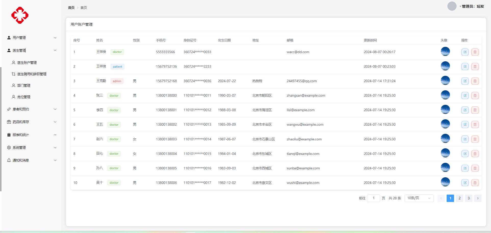
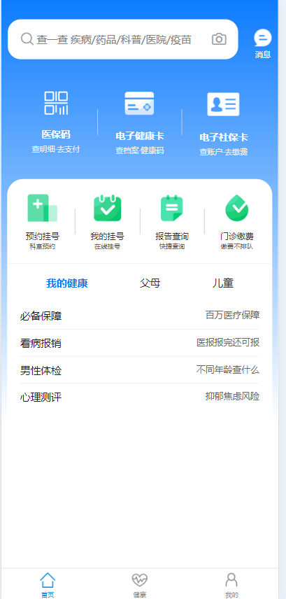
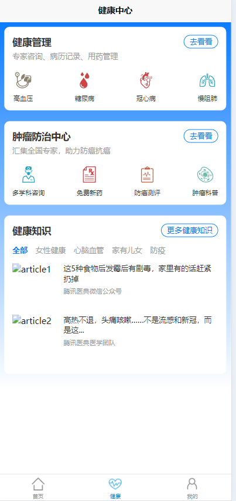

**医疗智慧平台**

介绍：这是一个智慧后勤管理系统，专为医院设计，涵盖多项核心功能，包括流程管理、能耗管理、巡检系统、监控系统、报修管理和数据服务。全面提升医院后勤管理的智能化水平，优化工作流程，确保运维效率与数据驱动的决策能力。智慧医疗平台利用 SpringCloud 构建微服务架构，结合 Redis 和 Kafka 提供高效稳定的医疗服务；前端采用 Vue.js 和 Uniapp 实现跨平台用户界面，提升用户体验。

技术栈：SpringCloud、Redis、Kafka、vue、uniapp、Mysql

**服务分布：**

| 服务名称                 | 服务 类型      |
| ------------------------ | -------------- |
| UniappGateWayApplication | uniapp网关服务 |
| WebGatrWayApplication    | web网关服务    |
| UserApplication          | 用户服务       |
| DoctorApplication        | 医生服务       |
| PatientApplication       | 患者服务       |
| AppointmentApplication   | 预约服务       |
| DepartmentApplication    | 部门服务       |
| MedicineApplication      | 药品服务       |
| FileApplication          | 文件服务       |

#### 页面

#### 参与贡献

1.  Fork 本仓库
2.  新建 Feat_xxx 分支
3.  提交代码
4.  新建 Pull Request

#### 特技

1.  使用 Readme\_XXX.md 来支持不同的语言，例如 Readme\_en.md, Readme\_zh.md
2.  Gitee 官方博客 [blog.gitee.com](https://blog.gitee.com)
3.  你可以 [https://gitee.com/explore](https://gitee.com/explore) 这个地址来了解 Gitee 上的优秀开源项目
4.  [GVP](https://gitee.com/gvp) 全称是 Gitee 最有价值开源项目，是综合评定出的优秀开源项目
5.  Gitee 官方提供的使用手册 [https://gitee.com/help](https://gitee.com/help)
6.  Gitee 封面人物是一档用来展示 Gitee 会员风采的栏目 [https://gitee.com/gitee-stars/](https://gitee.com/gitee-stars/)